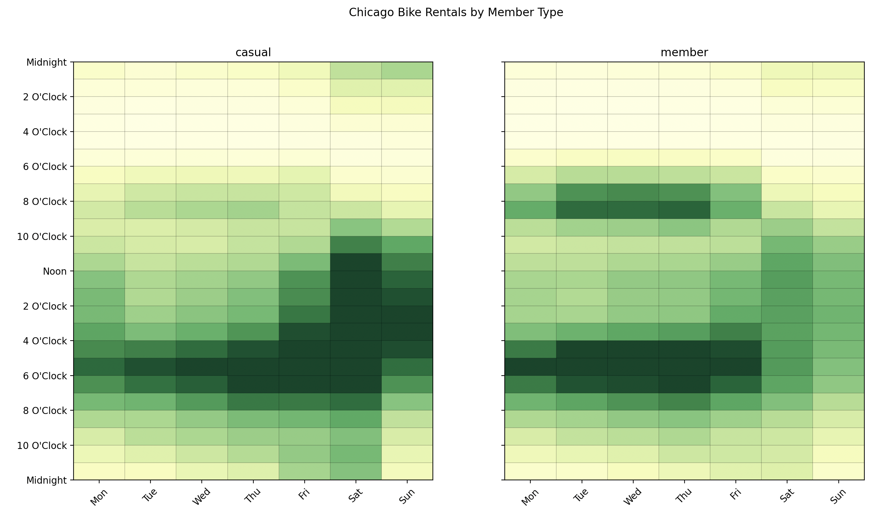
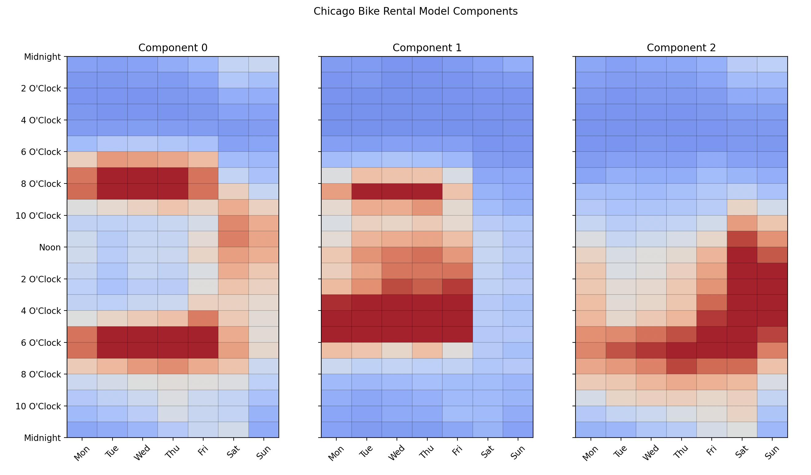
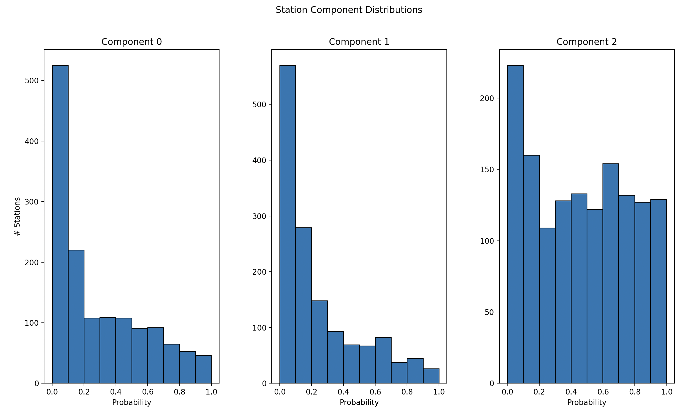
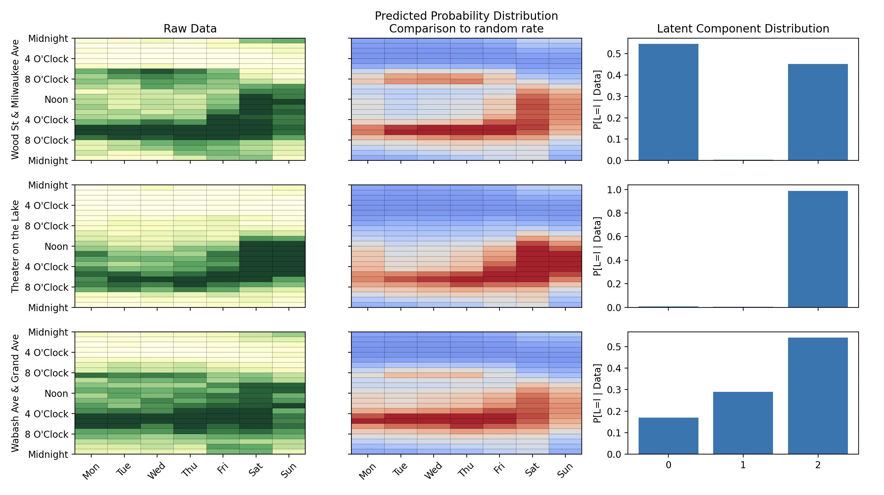

### 1. Transform and visualize

Transform and visualize data on a weekly calendar with the [`cal` attribute of DataFrames](./modules/extensions.md).

```python
import matplotlib.pyplot as plt

from latent_calendar.datasets import load_chicago_bikes

df = load_chicago_bikes()
df_member_casual = df.cal.aggregate_events("member_casual", timestamp_col="started_at")

(
    df_member_casual
    .cal.normalize("max")
    .cal.plot_by_row()
)
fig = plt.gcf()
fig.suptitle("Bike Rentals by Member Type")
plt.show()
```



### 2. Find latent structure

The `LatentCalendar` models calendar data by breaking down each calendar into a mixture of `n_components` calendars. Read more on the methodology [here](./methodology.md).

```python 
from latent_calendar import LatentCalendar
from latent_calendar.plot import plot_model_components

df_stations = df.cal.aggregate_events("start_station_name", timestamp_col="started_at")

model = LatentCalendar(n_components=3, random_state=42)
model.fit(df_wide)

plot_model_components(model)
fig = plt.gcf()
fig.suptitle("Chicago Bike Rental Model Components")
plt.show()
```



### 3. Recover components and distributions

The `LatentCalendar` provides soft clusters for each row which can be recovered with the `transform` method.

```python
df_component_probs = df_stations.cal.transform(model=model)

hist_kwargs = dict(bins=10, edgecolor="black", grid=False, layout=(1, 3))
axes = df_component_probs.hist(**hist_kwargs)
axes = axes.ravel()
for ax in axes: 
    ax.set_xlabel("Probability")
    title = ax.get_title()
    ax.set_title(f"Component {title}")
axes[0].set_ylabel("# Stations")
fig = plt.gcf()
fig.suptitle("Station Component Distributions")
plt.show()
```



The `predict` method recovers the joint distribution of the calendar data using the latent calendar components. 

```python
stations = ["Wood St & Milwaukee Ave", "Theater on the Lake", "Wabash Ave & Grand Ave"]
df_stations.loc[stations].cal.plot_profile()
plt.show()
```

