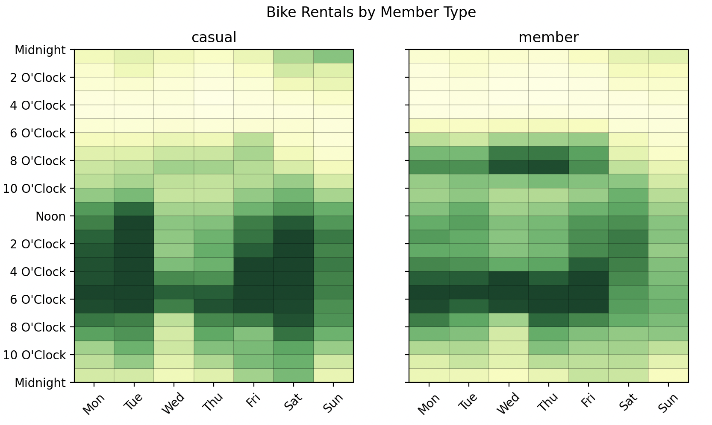

# Pandas Extensions

Transform and visualize data on a weekly calendar with the [`cal` attribute of DataFrames](./../modules/extensions.md).

## Event Level Data

```python
import matplotlib.pyplot as plt

from latent_calendar.datasets import load_chicago_bikes

df = load_chicago_bikes()
df.head()
```

```text
                 start_station_name end_station_name  rideable_type          started_at            ended_at member_casual
ride_id
ABF4F851DE485B76                NaN              NaN  electric_bike 2023-06-30 18:56:13 2023-06-30 19:30:40        member
F123B5D34B002CDB                NaN              NaN  electric_bike 2023-06-30 06:12:31 2023-06-30 06:23:05        member
CA8E2C38AF641DFB                NaN              NaN  electric_bike 2023-06-30 08:28:51 2023-06-30 08:37:45        member
93CCE4EA48CFDB69                NaN              NaN  electric_bike 2023-06-30 09:09:24 2023-06-30 09:17:41        member
FDBCEFE7890F7262                NaN              NaN  electric_bike 2023-06-30 16:29:48 2023-06-30 16:38:51        member
```

## Calendar Data

Aggregate event level data into wide format calendar data with the [`cal.aggregate_events`](./../modules/extensions.md#latent_calendar.extensions.DataFrameAccessor.aggregate_events) method. This results in 7 * 24 = 168 columns, one for each hour of the week.


```python
df_member_casual = df.cal.aggregate_events("member_casual", "started_at")
```

```text
day_of_week      0                              ...     6
hour            0    1    2   3   4    5    6   ...    17    18    19    20   21   22   23
member_casual                                   ...
casual         250  137  102  55  47   99  231  ...  1287  1195  1165   980  774  488  331
member         165   89   74  52  59  273  838  ...  1307  1355  1251  1137  800  505  294

[2 rows x 168 columns]
```

## Visualize Calendar Data

Various plot methods are available on the `cal` attribute of DataFrames. For instance, the [`plot_by_row`](./../modules/extensions.md#latent_calendar.extensions.DataFrameAccessor.plot_by_row) plots each row of the wide format calendar data as a separate calendar.

Custom [color maps](./../modules/plot/colors.md#latent_calendar.plot.colors) can be passed, but normalizing each row by the maximum value also does the trick.

```python
(
    df_member_casual
    .cal.normalize("max")
    .cal.plot_by_row()
)
fig = plt.gcf()
fig.suptitle("Bike Rentals by Member Type")
plt.show()
```


