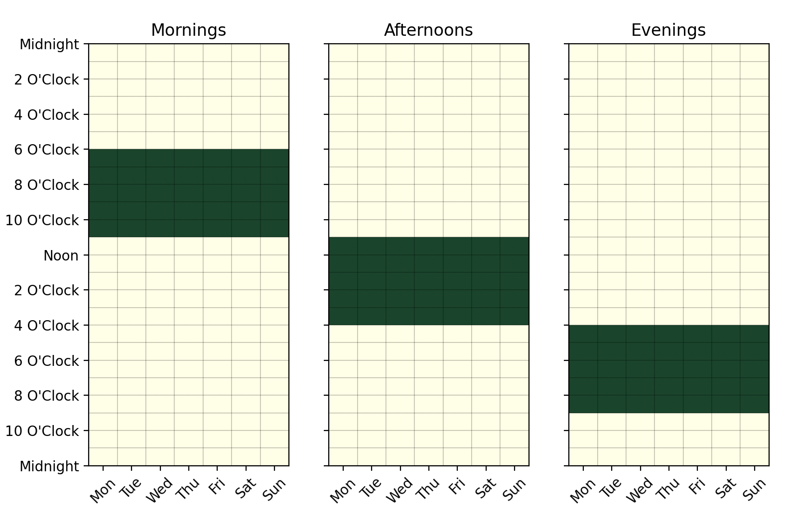

Create some segments for a calendar:

```python
import pandas as pd
import numpy as np

from latent_calendar.segments import create_box_segment, stack_segments

mornings = create_box_segment(
    day_start=0, day_end=7, hour_start=6, hour_end=11, name="Mornings"
)
afternoons = create_box_segment(
    day_start=0, day_end=7, hour_start=11, hour_end=16, name="Afternoons"
)
evenings = create_box_segment(
    day_start=0, day_end=7, hour_start=16, hour_end=21, name="Evenings"
)

df_segments = stack_segments([
    mornings,
    afternoons,
    evenings,
])

df_segments.cal.plot_by_row()
```




These can be used to sum over for analysis of counts or probabilities by segment.

```python
nrows = 10
ncols = len(df_segments.columns)

df = pd.DataFrame(np.ones((nrows, ncols)))

df_summed = df.cal.sum_over_segments(df_segments)
df_summed
```

```text
   Mornings  Afternoons  Evenings
0      35.0        35.0      35.0
1      35.0        35.0      35.0
2      35.0        35.0      35.0
3      35.0        35.0      35.0
4      35.0        35.0      35.0
5      35.0        35.0      35.0
6      35.0        35.0      35.0
7      35.0        35.0      35.0
8      35.0        35.0      35.0
9      35.0        35.0      35.0
```
