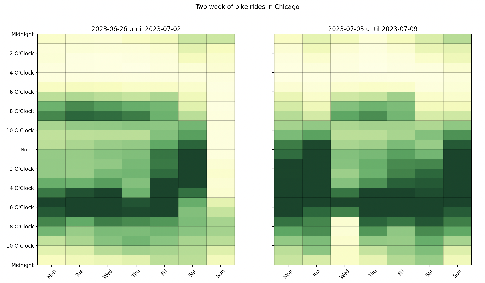
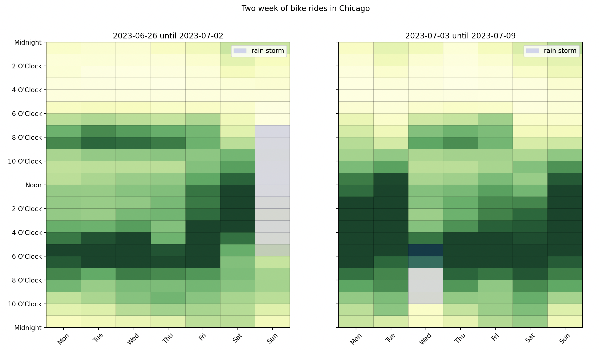
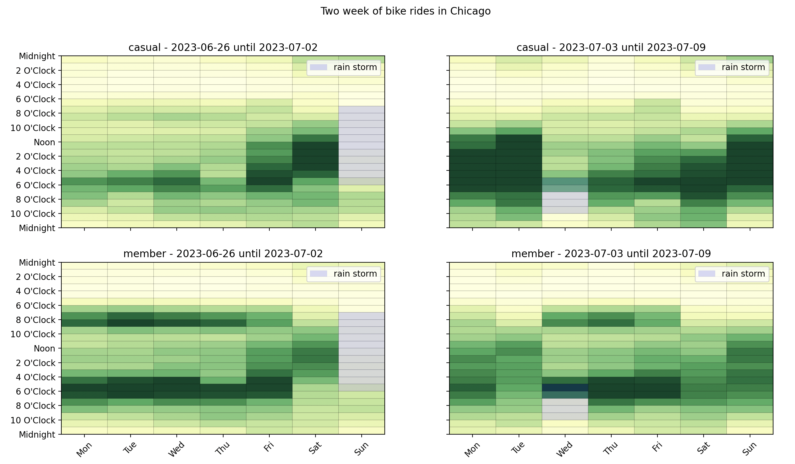
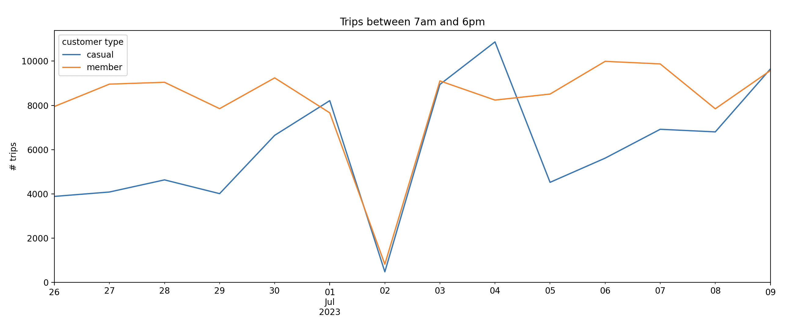

# Bikes in Chicago

The Chicago dataset is bike trips in the city of Chicago.

```python
import pandas as pd

import matplotlib.pyplot as plt

from latent_calendar.datasets import load_chicago_bikes
from latent_calendar.plot.elements import CalendarEvent

df = load_chicago_bikes()
df.head()
```

```text
                 start_station_name end_station_name  rideable_type          started_at            ended_at member_casual
ride_id
ABF4F851DE485B76                NaN              NaN  electric_bike 2023-06-30 18:56:13 2023-06-30 19:30:40        member
F123B5D34B002CDB                NaN              NaN  electric_bike 2023-06-30 06:12:31 2023-06-30 06:23:05        member
CA8E2C38AF641DFB                NaN              NaN  electric_bike 2023-06-30 08:28:51 2023-06-30 08:37:45        member
93CCE4EA48CFDB69                NaN              NaN  electric_bike 2023-06-30 09:09:24 2023-06-30 09:17:41        member
FDBCEFE7890F7262                NaN              NaN  electric_bike 2023-06-30 16:29:48 2023-06-30 16:38:51        member
```

This dataset is two weeks of data starting at the end of June 2023. We can easily see this by plotting it as a calendar grouped by the week of year. 

```python 
# Map the week number to a human readable label
df["week_number"] = df["started_at"].dt.isocalendar().week

# Bit scary but just trying to make a nice label
def create_label(df: pd.DataFrame) -> pd.Series:
    first_date = df["first_date"]
    last_date = df["last_date"]
    return first_date.dt.date.astype(str).str.cat(
        last_date.dt.date.astype(str), sep=" until "
    )

label = (
    df.groupby("week_number")
    .agg(first_date=("started_at", "min"), last_date=("started_at", "max"))
    .pipe(create_label)
)
df["week_of_year"] = df["week_number"].map(label.to_dict())

df_wide = df.cal.aggregate_events("week_of_year", "started_at")

(
    df_wide
    .cal.normalize("max")
    .cal.plot_by_row()
)
fig = plt.gcf()
fig.suptitle("Two week of bike rides in Chicago")
plt.show()
```

We are able to understand that the data is two weeks of data starting at the end of June 2023, but also see that there is heavy influence from the July 4 holiday weekend. People have off work and this is reflected in the data.



Though the holiday effect around the 4th, there seems to be a lower volume the Sunday before and after work the day after. Interestingly enough, there was [a rain storm on the weekend](https://www.wunderground.com/history/daily/us/il/chicago/KMDW/date/2023-7-2) and  [another storm the Wednesday the 4th](https://www.wunderground.com/history/daily/KMDW/date/2023-7-5). We can mark this on the calendar for reference.

```python
def create_plot_storms_func(first_storm: CalendarEvent, second_storm: CalendarEvent):
    def plot_storms(first_week_ax: plt.Axes, second_week_ax: plt.Axes):
        alpha = 0.15
        first_storm.plot(ax=first_week_ax, facecolor="blue", alpha=alpha, label="rain storm")
        second_storm.plot(ax=second_week_ax, facecolor="blue", alpha=alpha, label="rain storm")
        first_week_ax.legend()
        second_week_ax.legend()

    return plot_storms

first_storm = CalendarEvent(day=6, start=7, end=18)
second_storm = CalendarEvent(day=2, start=17, end=22)
plot_storms = create_plot_storms_func(first_storm, second_storm)

(
    df_wide
    .cal.normalize("max")
    .cal.plot_by_row()
)
fig = plt.gcf()
fig.suptitle("Two week of bike rides in Chicago")


plot_storms(fig.axes[0], fig.axes[1])
plt.show()
```




Let's break it down further by adding the `member_casual` column to the aggregation.

```python
df_wide = df.cal.aggregate_events(["member_casual", "week_of_year"], "started_at")


def title_func(idx, row) -> str:
    group, week = idx

    return f"{group} - {week}"


(
    df_wide
    .cal.normalize("max")
    .cal.plot_by_row(max_cols=2, title_func=title_func)
)
fig = plt.gcf()
fig.suptitle("Two week of bike rides in Chicago")

axes = fig.axes

plot_storms(axes[0], axes[1])
plot_storms(axes[2], axes[3])

plt.show()
```

We can see that the holiday weekend has heavy volume from the casual riders showing on the Monday and Tuesday of the holiday weekend. Not only that, but the members that use the bikes heavily to commute shift their usage with this holiday too. 




The effect of rain can be investigated by sum the trips that happen during the day time. We can do this by creating a segment for each day of the week between the hours of 7am and 6pm, the time of the Sunday storm. 

```python
from latent_calendar.vocab import DOWHour
from latent_calendar.segments.hand_picked import create_series_for_range, stack_segments

all_daytime_rain = stack_segments([
    create_series_for_range(
        start=DOWHour(dow=dow, hour=7), end=DOWHour(dow=dow, hour=18)
    ).rename(f"all_daytime_{dow}")
    for dow in range(7)
])

df_volume = df_wide.cal.sum_over_segments(all_daytime_rain)
```

These are the row totals between the hours of 7am and 6pm for each day of the week at the same index level as before.


```text
                                           all_daytime_0  all_daytime_1  all_daytime_2  all_daytime_3  all_daytime_4  all_daytime_5  all_daytime_6
member_casual week_of_year
casual        2023-06-26 until 2023-07-02           3887           4086           4634           4012           6647           8213            481
              2023-07-03 until 2023-07-09           8946          10868           4523           5616           6920           6802           9643
member        2023-06-26 until 2023-07-02           7949           8960           9043           7852           9242           7663            822
              2023-07-03 until 2023-07-09           9105           8239           8511           9989           9873           7846           9573
```


Visualizing this data, we can see the heavy impact of the Sunday weather for casual riders and members alike but not enough to ruin the holiday weekend.

```python


def replace_index(ser: pd.Series, index: pd.Index) -> pd.Series: 
    ser.index = index 
    return ser
    
start_date = df["started_at"].min().date()
end_date = df["started_at"].max().date()
dates = pd.date_range(start_date, end_date, freq="D")

ax = (
    df_volume
    .stack()
    .unstack(0)
    .pipe(replace_index, index=dates)
    .plot()
)
ax.set(
    ylabel="# trips",
    title="Trips between 7am and 6pm",
    ylim=(0, None),
)
ax.legend(title="customer type")
plt.show()
```

