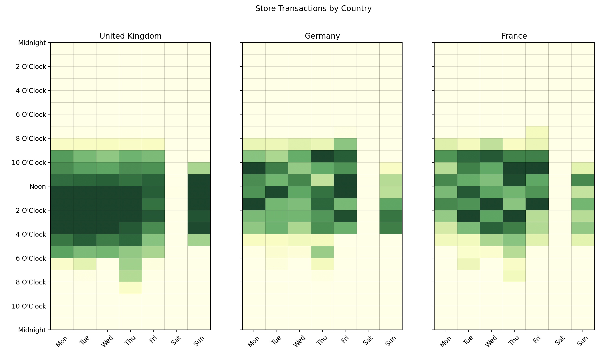

```python
import matplotlib.pyplot as plt

from latent_calendar.datasets import load_online_transactions

df = load_online_transactions()
df.head()
```

```text
  Invoice StockCode                          Description  Quantity         InvoiceDate  Price  Customer ID         Country
0  489434     85048  15CM CHRISTMAS GLASS BALL 20 LIGHTS        12 2009-12-01 07:45:00   6.95      13085.0  United Kingdom
1  489434    79323P                   PINK CHERRY LIGHTS        12 2009-12-01 07:45:00   6.75      13085.0  United Kingdom
2  489434    79323W                  WHITE CHERRY LIGHTS        12 2009-12-01 07:45:00   6.75      13085.0  United Kingdom
3  489434     22041         RECORD FRAME 7" SINGLE SIZE         48 2009-12-01 07:45:00   2.10      13085.0  United Kingdom
4  489434     21232       STRAWBERRY CERAMIC TRINKET BOX        24 2009-12-01 07:45:00   1.25      13085.0  United Kingdom
```

By default, a new `cal` attribute will be added to DataFrames given access to module functionality.

```python
df_wide = df.cal.aggregate_events("Country", "InvoiceDate")

df_wide.head()
```

```text
day_of_week  0                                                                                  1     ...  5     6
hour        0  1  2  3  4  5  6  7   8   9   10  11   12  13  14   15  16 17 18 19 20 21 22 23 0  1   ... 22 23 0  1  2  3  4  5  6  7  8  9   10  11  12  13  14   15 16 17 18 19 20 21 22 23
Country                                                                                               ...
Australia    0  0  0  0  0  0  0  0   0  27   6  19   20   7   2  105  27  0  0  0  0  0  0  0  0  0  ...  0  0  0  0  0  0  0  0  0  0  0  0  11  37  20   0  16    0  0  0  0  0  0  0  0  0
Austria      0  0  0  0  0  0  0  0   9  55  81   0   18   0   0   33   0  0  0  0  0  0  0  0  0  0  ...  0  0  0  0  0  0  0  0  0  0  0  0   0   0   0   0  37    0  0  0  0  0  0  0  0  0
Bahrain      0  0  0  0  0  0  0  0   0   0   1   6    0  13   0    0   0  0  0  0  0  0  0  0  0  0  ...  0  0  0  0  0  0  0  0  0  0  0  0   0   0   0   0   0    0  0  0  0  0  0  0  0  0
Belgium      0  0  0  0  0  0  0  0  15  15  42  26  109  54  38   17  26  0  0  0  0  0  0  0  0  0  ...  0  0  0  0  0  0  0  0  0  0  0  0  18  20  28  41   0  131  0  0  0  0  0  0  0  0
Bermuda      0  0  0  0  0  0  0  0   0   0   0   0    0   0   0    0   0  0  0  0  0  0  0  0  0  0  ...  0  0  0  0  0  0  0  0  0  0  0  0   0   0   0   0   0    0  0  0  0  0  0  0  0  0

[5 rows x 168 columns]
```

We can clearly see the weekly hours of operation for these countries. Even though these are online transactions, these hours affect the transaction times.

The slight shift in hours for the UK might be the difference in time zones between the UK and the other countries. Maybe it could be difference in buying patterns of these populations. Not sure but this visual gives us a good glance at the data and starting point to ask questions

```python
countries = ["United Kingdom", "Germany", "France"]

(
    df_wide
    .loc[countries]
    .cal.normalize("max")
    .cal.plot_by_row()
)
fig = plt.gcf()
fig.suptitle("Store Transactions by Country")
plt.show()
```


