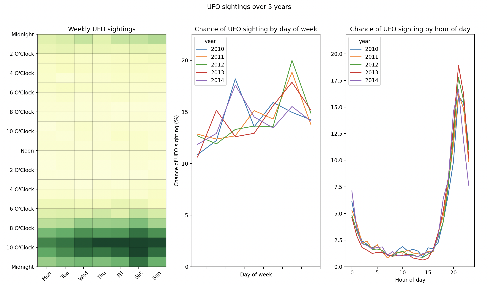

# UFO Sightings

```python
import matplotlib.pyplot as plt

from latent_calendar.datasets import load_ufo_sightings

df = load_ufo_sightings()
```

Each row of the dataset is a UFO sighting somewhere around the world.

```text
            Date_time                  city state/province country  ...                                        description date_documented    latitude   longitude
0 1949-10-10 20:30:00            san marcos             tx      us  ...  This event took place in early fall around 194...       4/27/2004  29.8830556  -97.941111
1 1949-10-10 21:00:00          lackland afb             tx     NaN  ...  1949 Lackland AFB&#44 TX.  Lights racing acros...      12/16/2005    29.38421  -98.581082
2 1955-10-10 17:00:00  chester (uk/england)            NaN      gb  ...  Green/Orange circular disc over Chester&#44 En...       1/21/2008        53.2   -2.916667
3 1956-10-10 21:00:00                  edna             tx      us  ...  My older brother and twin sister were leaving ...       1/17/2004  28.9783333  -96.645833
4 1960-10-10 20:00:00               kaneohe             hi      us  ...  AS a Marine 1st Lt. flying an FJ4B fighter/att...       1/22/2004  21.4180556 -157.803611

[5 rows x 11 columns]
```

```python
df["year"] = df["Date_time"].dt.year

df_wide = df.cal.aggregate_events("year", "Date_time")

df_5_year = df_wide.tail(5)
```

which has the data in the wide format where each row is a weekly calendar. 

```text
vocab  00 00  00 01  00 02  00 03  00 04  00 05  00 06  00 07  00 08  00 09  00 10  00 11  ...  06 12  06 13  06 14  06 15  06 16  06 17  06 18  06 19  06 20  06 21  06 22  06 23
year                                                                                       ...
2010      18     25     15     10     13     16      8      6      2      5      7     11  ...     14     10      6     14     22     13     29     37     50     86     84     64
2011      38     27     18     20     14     13      9      6      9      7     11      8  ...     10     11      9     12     13     19     33     56     93     92     97     82
2012      46     29     20     16     19     17     14     18     12     13     16     16  ...     13      7     17     20     15     18     43     74    142    186    147    103
2013      38     33     15     11      9     14     13     11     11      3     10      8  ...      8      6      6      6     16     24     58     83    131    231    194    109
2014      12      9      7      8      6      5      6      4      6      3      2      6  ...      6      0      6      6      5      7     17     28     52     57     39     31

[5 rows x 168 columns]
```

We can make use the [`cal` attribute](./../../modules/extensions.md) further to plot an aggregate of the data and plots of the data by day of week and hour of day.

```python

fig, axes = plt.subplots(ncols=3)

df_5_year.sum().cal.plot_row(ax=axes[0])

axes[0].set(
    title="Weekly UFO sightings",
)

for aggregation, ax in zip(["dow", "hour"], axes.ravel()[1:]): 
    (
        df_5_year
        .cal.sum_over_vocab(aggregation=aggregation)
        .cal.normalize("probs")
        .mul(100)
        .T.plot(ax=ax)
    )
    ymax = ax.get_ylim()[1]
    ax.set_ylim(0, ymax * 1.1)

axes[1].set_xticks(axes[0].get_xticks())

axes[1].set(
    title="Chance of UFO sighting by day of week",
    xlabel="Day of week",
    ylabel="Chance of UFO sighting (%)",
)
axes[2].set(
    title="Chance of UFO sighting by hour of day",
    xlabel="Hour of day",
    ylabel="", 
)
fig.suptitle("UFO sightings over 5 years")
plt.show()
```

