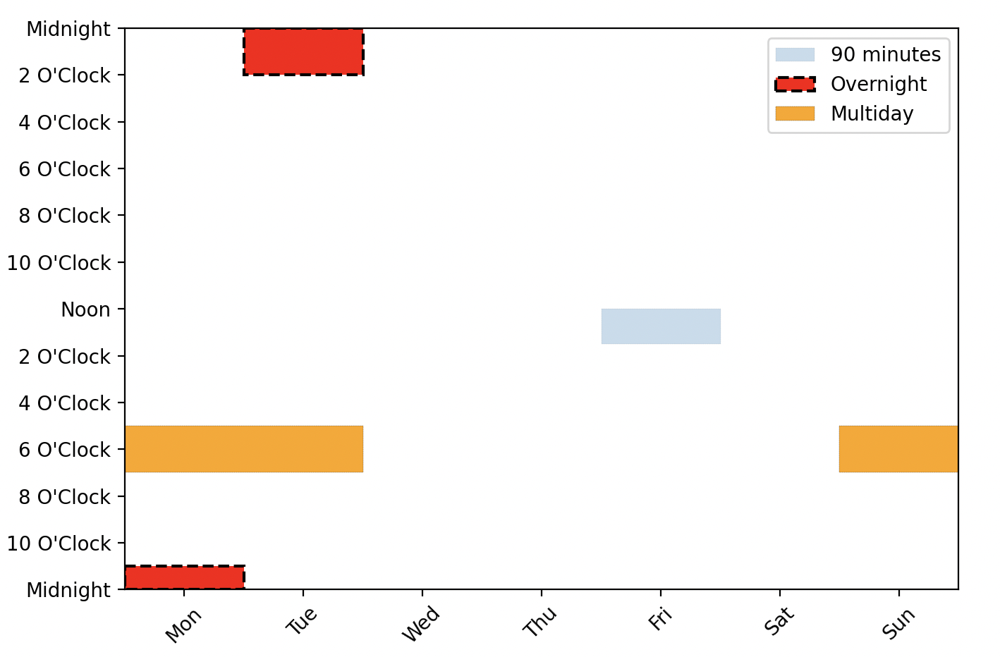

Can use the `CalendarEvent` class to add arbitrary events to calendar.

The constructor takes a day of week, start time, an end time or duration, and
number of days.

The `plot` method takes a `plt.Axes` and allows for customization with additional
keyword arguments

```python
import matplotlib.pyplot as plt

from latent_calendar.plot import plot_blank_calendar
from latent_calendar.plot.elements import CalendarEvent

ax = plot_blank_calendar()

event = CalendarEvent(
    day=4, start=12, duration=90,
)
event.plot(ax=ax, label="90 minutes", linestyle="--", alpha=0.25)

event = CalendarEvent(
    day=0, start=23, duration=3 * 60,
)
event.plot(ax=ax, label="Overnight", facecolor="red", linestyle="dashed", lw=1.5)

event = CalendarEvent(
    day=6, start=17, end=19, days=3,
)
event.plot(ax=ax, label="Multiday", facecolor="orange", linestyle="--")

ax.legend()
plt.show()
```



