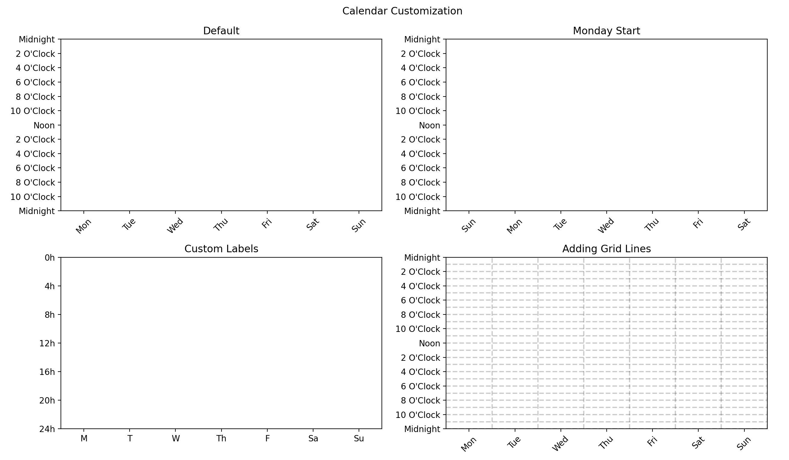
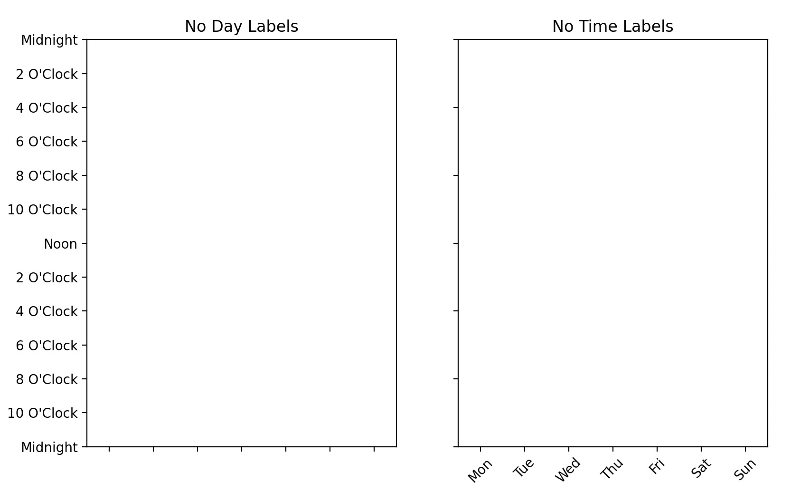
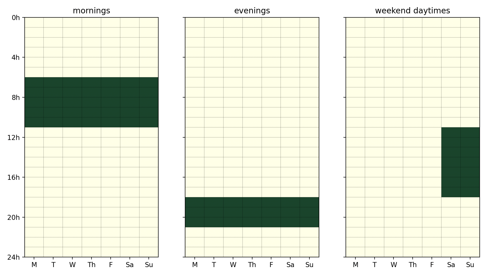

Each calendar plot is made up of the following components:

- X axis (Day of week)
- Y axis (Time of the day)
- Grid Lines
- Events (Rectangles)

The X axis and Y axis have default values but can be customized


```python
import matplotlib.pyplot as plt

from latent_calendar.plot import plot_blank_calendar
from latent_calendar.plot.elements import DayLabeler, TimeLabeler, GridLines


fig, axes = plt.subplots(ncols=2, nrows=2)
fig.suptitle("Calendar Customization")

ax = axes[0, 0]
plot_blank_calendar(ax=ax)
ax.set_title("Default")

ax = axes[0, 1]
plot_blank_calendar(
    ax=ax, monday_start=False
)
ax.set_title("Sunday Start")

ax = axes[1, 0]
day_labeler = DayLabeler(days_of_week=["M", "T", "W", "Th", "F", "Sa", "Su"], rotation=0)
hour_formatter = lambda hour: f"{hour}h"
time_labeler = TimeLabeler(hour_formatter=hour_formatter, stride=4)
plot_blank_calendar(
    ax=ax,
    day_labeler=day_labeler,
    time_labeler=time_labeler,
)
ax.set_title("Custom Labels")

ax = axes[1, 1]
grid_lines = GridLines(dow=True, hour=True)
plot_blank_calendar(
    ax=ax, grid_lines=grid_lines
)
ax.set_title("Adding Grid Lines")

plt.show()
```



Additionally, the labels can be turned off completely. This is done automatically with functions that plot multiple calendars.

```python
fig, axes = plt.subplots(ncols=2, nrows=1)

ax = axes[0]
day_labeler = DayLabeler(days_of_week=["M", "T", "W", "Th", "F", "Sa", "Su"], rotation=0, display=False)
plot_blank_calendar(
    day_labeler=day_labeler,
    ax=axes[0]
)
ax.set(title="No Day Labels")

ax = axes[1]
hour_formatter = lambda hour: f"{hour}h"
time_labeler = TimeLabeler(hour_formatter=hour_formatter, stride=4, display=False)
plot_blank_calendar(
    time_labeler=time_labeler,
    ax=ax
)
ax.set(title="No Time Labels")
plt.show()
```



This customization is available through the other plotting functions and methods as well. Access them with through the same parameter names.

```python
from latent_calendar.segments.hand_picked import create_box_segment, stack_segments

mornings = create_box_segment(
    hour_start=6,
    hour_end=11,
    day_start=0, day_end=7,
    name="mornings"
)

evenings = create_box_segment(
    hour_start=18,
    hour_end=21,
    day_start=0, day_end=7,
    name="evenings"
)

weekend_daytimes = create_box_segment(
    hour_start=11,
    hour_end=18,
    day_start=5, day_end=7,
    name="weekend daytimes"
)

df_segments = stack_segments([mornings, evenings, weekend_daytimes])

# Plotting
(
    df_segments
    .cal.plot_by_row(
        day_labeler=day_labeler,
        time_labeler=time_labeler
    )
)
plt.show()

```


