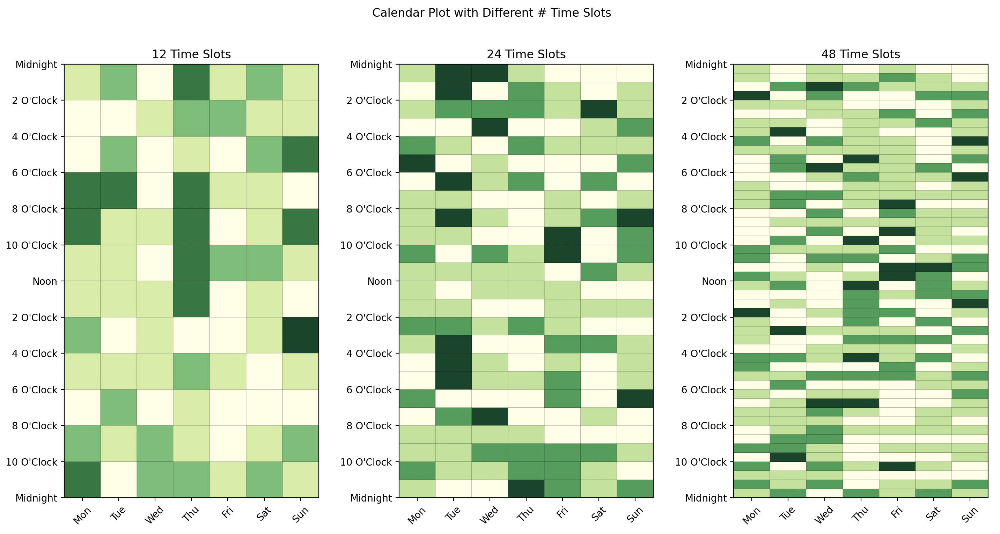

All number of time slots divisible by 7 (days of the week) are supported for plotting. This is thanks to the `plot_calendar` function taking an iterable.

```python
import numpy as np

import matplotlib.pyplot as plt

from latent_calendar.plot import plot_calendar
from latent_calendar.plot.iterate import iterate_matrix
from latent_calendar.plot.colors import create_default_cmap

time_slots = [12, 24, 48]

fig, axes = plt.subplots(ncols=len(time_slots))

rng = np.random.default_rng(0)
for ts, ax in zip(time_slots, axes.ravel()):
    data = rng.poisson(lam=1, size=(7, ts))

    cmap = create_default_cmap(data.max())
    plot_calendar(
        iterate_matrix(data),
        cmap=cmap,
        ax=ax,
    )
    ax.set_title(f"{ts} Time Slots")

fig.suptitle("Calendar Plot with Different # Time Slots")
plt.show()
```


