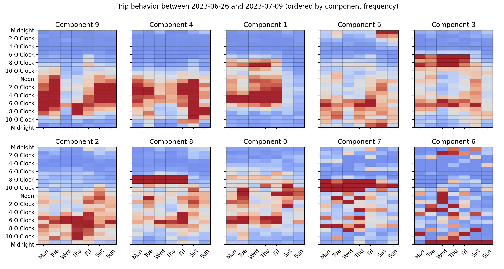

# Latent Calendar

[](https://github.com/astral-sh/ruff)
[](https://github.com/wd60622/latent-calendar/actions/workflows/tests.yml)
[](https://badge.fury.io/py/latent-calendar)
[](https://wd60622.github.io/latent-calendar/)

Analyze and model data on a weekly calendar

## Installation

Install from PyPI: 

```bash
pip install latent-calendar
```

Or install directly from GitHub for the latest functionality. 

## Features 

- Integrated automatically into `pandas` with [`cal` attribute on DataFrames and Series](./modules/extensions.md)
- Compatible with [`scikit-learn` pipelines and transformers](./examples/model/sklearn-compat.md)
- [Transform and visualize data on a weekly calendar](./examples/cal-attribute.md)
- [Model weekly calendar data with a mixture of calendars](methodology.md)
- Create lower dimensional representations of calendar data


## Quick Start

```python
from latent_calendar.datasets import load_chicago_bikes
from latent_calendar import LatentCalendar
from latent_calendar.plot import plot_model_components

import matplotlib.pyplot as plt

df_trips = load_chicago_bikes()
df_stations = df_trips.cal.aggregate_events("start_station_name", "started_at", minutes=60)

model = LatentCalendar(n_components=10, random_state=42)
model.fit(df_stations)

order = model.component_distribution_.argsort()[::-1]
plot_model_components(model, components=order)
first_date, last_date = df_trips["started_at"].min().date(), df_trips["started_at"].max().date()
title = f"Trip behavior between {first_date} and {last_date} (ordered by component frequency)"
plt.suptitle(title)
```


