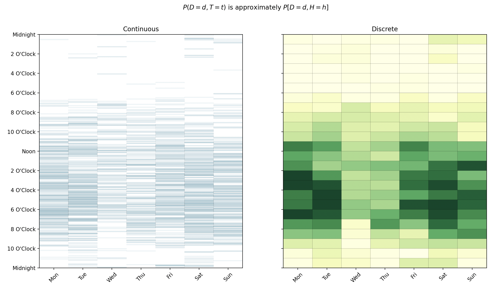
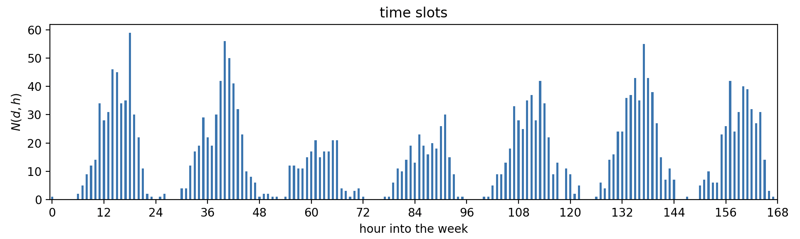

---
hide:
    - navigation
comments: true
---

## Multinomial Distribution from Events on Calendar

With $D = \text{Day of Week}$ with $d \in \{\text{Monday}, \text{Tuesday}, ..., \text{Sunday}\}$ and $T = \text{Time of Day}$ with $t \in [0, 24)$, we are interested in the joint distribution of the $P(D=d, T=t)$.

However, if we discretize $T$ into $H = \text{Hour of Day}$ which takes values $h \in \{0, 1, 2, ..., 23\}$, we get a discrete approximation of the distribution, $P[D=d, H=h]$

Introducing the number of events, $N$, we can express this quantity as

$$P[D=d, H=h] = \sum_{n=0}^{\infty} P[N=n] \times P[D=d, H=h | N=n]$$

having

$$\sum_{d, h \in D \times H} N(d, h) = n$$

where $N(d, h)$ is the number of events at $D=d$, $H=h$.

This is two quantities now:

1. How many events will happen: $P[N=n]$
2. When on the calendar will these events happen: $P[D=d, H=h | N=n]$

But since the day of week and time of day make up a discrete space of "time slots", we can use the multinomial distribution to model quantity 2.

## Linking to Latent Dirichlet Allocation

The generative model for Latent Dirichlet Allocation is a mixture of multinomial distributions allowing us to introduce $c$ calendar distributions.

$$P[D=d, H=h | N=n] = \sum_{l=1}^c P[L=l | N=n] \times P[D=d, H=h | L=l, N=n]$$

1. $P[L=l | N=n]$ is the probability of being latent component
2. $P[D=d, H=h | L=l, N=n]$ is the calendar from latent component $l$

By introducing latent calendar distributions, we introduce correlations between the time slots.
